# Neural Radiance Fields (NeRF) — PyTorch Implementation


> **Note:** This is an ongoing research implementation and is not the final version of the repository.
>
> Future work includes implementing distributed training, extending experiments to the remaining **NeRF-Synthetic** datasets (Chair, Drums, Ficus, Hotdog, Materials, Mic, and Ship), and adding additional benchmarks, ablation studies, and performance optimizations.

A PyTorch implementation of **NeRF: Representing Scenes as Neural Radiance Fields for View Synthesis** (Mildenhall et al., ECCV 2020).

This repository provides an end-to-end pipeline covering camera ray generation, positional encoding, hierarchical volume sampling (coarse and fine networks), and volumetric rendering for 3D scene reconstruction from 2D images.


## Experimental Results

This implementation has been trained and evaluated on multiple scenes from the Synthetic NeRF Blender dataset.

Current experiments include:

- Lego
- Drums

The following sections demonstrate reconstruction quality and training progression for each scene independently.

## Lego Scene

### Visual Progression Across Epochs

| Epoch | Camera View 1 | Camera View 2 | Reconstruction Stage & Metrics |
| :---: | :---: | :---: | :--- |
| **50** |  |  | **Coarse Geometry Initialization**<br>• Initial spatial density density field learning<br>• Low PSNR; visible volumetric artifacts |
| **150** |  |  | **Structural Convergence**<br>• Primary surface bounds & silhouette refinement<br>• Fine-network importance sampling activation |
| **250** |  |  | **Color & Texture Synthesis**<br>• Albedo & diffuse color resolution<br>• Reduction in cloudiness/translucency |
| **350** |  |  | **High-Frequency Detail Recovery**<br>• Fine spatial frequency recovery ($\gamma(\mathbf{x})$ mapping)<br>• Sharp boundary edges |
| **500** |  |  | **Fully Converged Radiance Field**<br>• High-fidelity specular highlights & novel view synthesis<br>• Peak PSNR & SSIM metrics |


---

### Compact Quick-Reference Summary

If a concise 3-stage summary table is preferred for the top section of the paper repository:

| Stage 1: Initial (Epoch 50) | Stage 2: Intermediate (Epoch 250) | Stage 3: Fully Converged (Epoch 500) |
| :---: | :---: | :---: |
|  |  |  |
| *Coarse spatial density learning* | *Texture & color refinement* | *High-fidelity view synthesis* |

---

## Drums Scene

The Drums scene is considerably more challenging than Lego due to metallic reflections, thin structures, high-frequency textures, and strong view-dependent appearance. These characteristics make accurate geometry and radiance estimation significantly more difficult, requiring the model to learn complex lighting interactions and fine structural details.

> The results presented below were obtained after **500 training epochs**. While the reconstruction already captures the overall scene geometry and appearance, the Drums scene typically benefits from **1,000–1,400 training epochs**, leading to improved surface detail, sharper specular highlights, and higher-quality novel view synthesis. The current results therefore represent a partially converged model, with further training expected to improve reconstruction fidelity.

### Visual Progression Across Epochs

| Epoch | Camera View 1 | Camera View 2 | Reconstruction Stage |
| :---: | :---: | :---: | :--- |
| **30** | 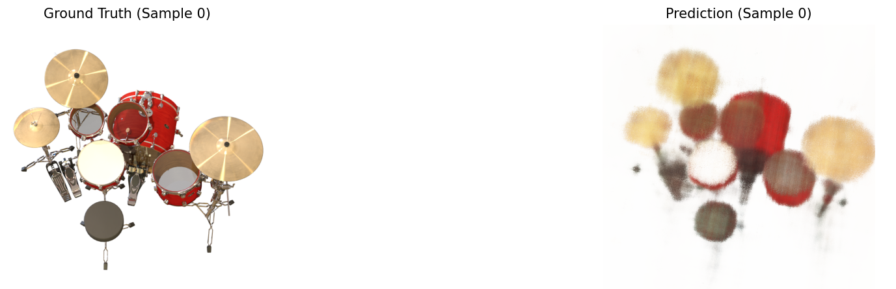 | 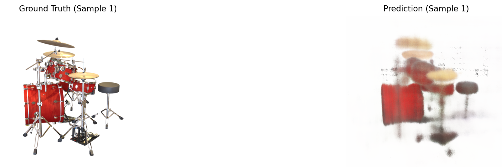 | Initial geometry estimation |
| **60** | 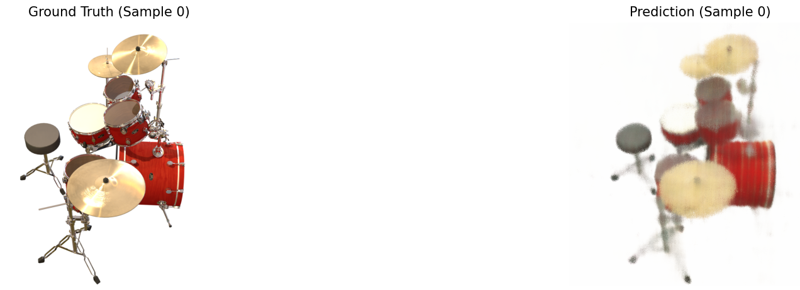 | 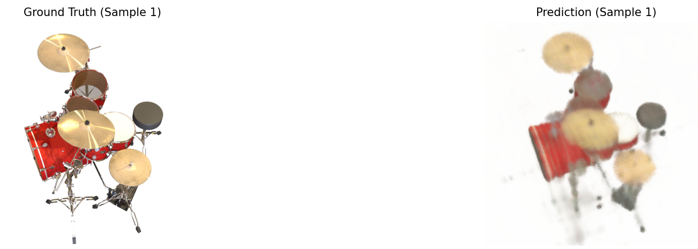 | Structural convergence |
| **100** | 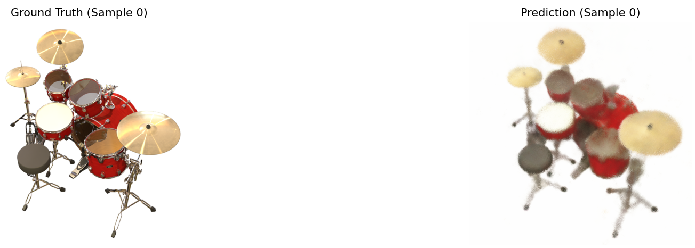 | 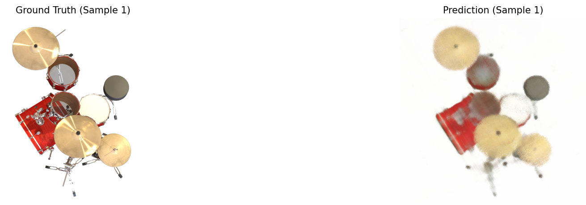 | Texture synthesis |
| **460** | 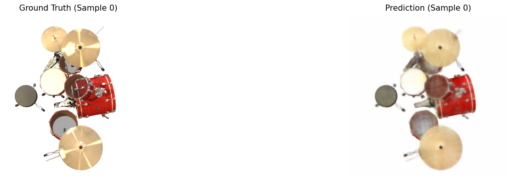 | 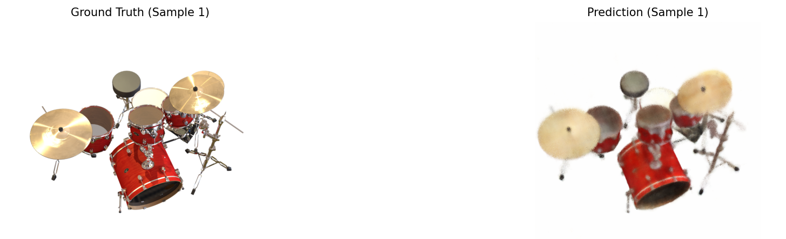 | Fine detail recovery |
| **500** | 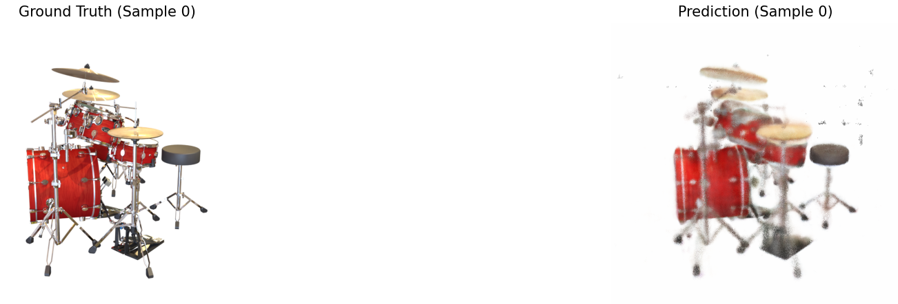 | 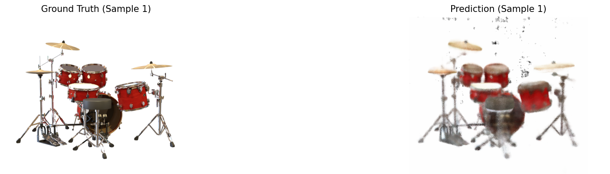 | Final reconstruction |

### Compact Summary

| Stage 1 | Stage 2 | Stage 3 |
| :---: | :---: | :---: |
|  |  |  |
| *Initial Geometry* | *Texture Refinement* | *Final Novel View Synthesis* |

---


# Novel View Synthesis

The following examples show novel view synthesis performed using trained checkpoints. Each rendered image was generated from camera poses unseen during training.

## Lego
| Prediction 1 | Prediction 2 |
| :---: | :---: |
| 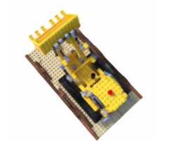 | 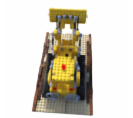 |

| Prediction 3 | Prediction 4 |
| :---: | :---: |
| 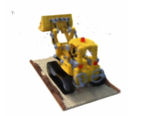 | 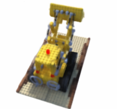 |

## Drums
| Prediction 1 | Prediction 2 |
| :---: | :---: |
| 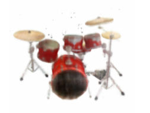 | 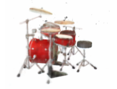 |

| Prediction 3 | Prediction 4 |
| :---: | :---: |
| 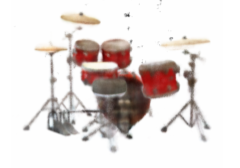 |  |

---

# Training Configuration

Unless otherwise stated, all experiments were performed using the following settings.

| Parameter | Value |
|-----------|------:|
| Optimizer | Adam |
| Learning Rate | 5e-4 |
| Batch Size | 2 |
| Training Rays | 1024 |
| Coarse Samples | 64 |
| Fine Samples | 128 |
| Hidden Dimension | 256 |
| Position Encoding Levels | 10 |
| Direction Encoding Levels | 4 |
| Epochs | 500 |

--- 

# Training Benchmarks

The implementation was trained on multiple hardware configurations to evaluate memory usage and training performance.

| GPU | VRAM | Dataset | Batch Size | Time / Epoch | Peak Memory |
|------|------|----------|-----------:|-------------:|------------:|
| RTX 3050 Laptop | 6 GB | Lego | 2 | 7.5 hrs | 5.9 GB |
| T4 GPU | 16 GB | Drums | 2 | 5.2 hrs | 5.6 GB |

---

## Training Curves

| Total Training Loss | Coarse Network Loss | Fine Network Loss |
|:-------------------:|:-------------------:|:-----------------:|
|  |  |  |

---


## Project Structure

The project is structured into modular PyTorch components inside `src/`:

```text
NeRF/
├── checkpoints/              # Saved model weights (.pt / .pth)
├── data/                     # Dataset directory (Blender / Synthetic NeRF)
├── renders/                  # Output renders (images / videos)
├── src/
│   ├── coarse_network.py     # Coarse MLP architecture
│   ├── fine_network.py       # Fine MLP architecture
│   ├── config.py             # Global hyperparameter management
│   ├── dataset_loader.py     # Data pipeline for Synthetic NeRF (Blender format)
│   ├── importance_sampler.py # Inverse CDF / Hierarchical sampling strategy
│   ├── main.py               # Main training loop entry point
│   ├── mlp.py                # Core NeRF network structure
│   ├── nerf_trainer.py       # Trainer class handling optimization & logging
│   ├── positional_encodings.py # High-frequency positional encoding (γ)
│   ├── random_ray_sampler.py # Random pixel/ray sampling logic
│   ├── ray_generator.py      # Pinhole camera model & ray generation
│   ├── render_img.py         # Full-image rendering pipeline
│   ├── stratified_sampler.py # Uniform bin sampling along rays
│   └── volume_renderer.py    # Alpha compositing & quadrature rendering
├── nerf_imp.ipynb            # Interactive exploration & debugging notebook
├── requirements.txt          # Python environment dependencies
└── README.md

```

---

## Core Methodology Overview

This implementation faithfully reproduces the two-stage NeRF pipeline:

1. **Ray Generation:** Rays $\mathbf{r}(t) = \mathbf{o} + t\mathbf{d}$ are generated for each pixel using pinhole camera intrinsics.
2. **Positional Encoding:** Spatial coordinates $\mathbf{x} = (x, y, z)$ and viewing directions $\mathbf{d} = (\theta, \phi)$ are mapped to a higher-dimensional space using Fourier features:

$$\gamma(p) = \left( \sin(2^0 \pi p), \cos(2^0 \pi p), \dots, \sin(2^{L-1} \pi p), \cos(2^{L-1} \pi p) \right)$$


3. **Hierarchical Sampling:**
* **Stratified Sampling:** Samples $N_c$ coarse points along each ray.
* **Importance Sampling:** Evaluates the coarse network weight distribution to sample $N_f$ additional fine points in high-density regions.


4. **Volume Rendering:** Density $\sigma$ and RGB color $\mathbf{c}$ are accumulated along rays via numerical quadrature:

$$\hat{C}(\mathbf{r}) = \sum_{i=1}^{N} T_i \left( 1 - \exp(-\sigma_i \delta_i) \right) \mathbf{c}_i, \quad \text{where } T_i = \exp\left(-\sum_{j=1}^{i-1} \sigma_j \delta_j\right)$$


---

## Quick Start

### 1. Prerequisites & Installation

Clone the repository and install dependencies:

```bash
git clone https://github.com/Himanshu7921/NeRF-PyTorch-Implementation
cd NeRF-PyTorch-Implementation
pip install -r requirements.txt
```

### 2. Dataset Setup

This repository supports the standard **Synthetic NeRF / Blender dataset** (e.g., Lego, Chair, Drums). Download a dataset from the [official NeRF repository](https://www.google.com/search?q=https://drive.google.com/drive/folders/128yAPlBh7O4yCc3jn13dTH2eHM-3uv75) and organize it as follows:

```text
data/
└── lego/
    ├── transforms_train.json
    ├── transforms_val.json
    ├── transforms_test.json
    ├── train/
    ├── val/
    └── test/

```

---

## Execution Instructions

### Training

To launch training using default parameters or custom hyperparameter configurations:

```bash
python src/main.py

```

*Weights and training logs will automatically save to `checkpoints/` and `wandb/` (if enabled).*

### Evaluation & Rendering

Render images from a trained checkpoint using the inference script.

**Basic Usage**

```bash
python src/render_img.py
```

**Arguments**

| Argument | Description | Default |
|----------|-------------|---------|
| `--checkpoint` | Path to the trained checkpoint | `./checkpoints/epoch_500.pth` |
| `--root_dir` | Path to the NeRF dataset | `data/nerf_synthetic/lego` |
| `--split` | Dataset split (`test` or `val`) | `test` |
| `--n_images` | Number of images to render | `1` |
| `--scale` | Rendering scale factor | `1.0` |
| `--num_rays` | Number of rays processed per rendering chunk | `1024` |
| `--n_points` | Number of coarse samples per ray | `64` |
| `--n_importance` | Number of fine samples per ray | `64` |

**Examples**

Render a single test image:

```bash
python src/render_img.py --checkpoint checkpoints/epoch_500.pth
```

Render 4 validation images:

```bash
python src/render_img.py --checkpoint checkpoints/epoch_500.pth --split val --n_images 4
```

Render at half resolution:

```bash
python src/render_img.py --checkpoint checkpoints/epoch_500.pth --scale 0.5
```

Render using a larger rendering chunk:

```bash
python src/render_img.py --checkpoint checkpoints/epoch_500.pth --num_rays 4096
```

Render with 128 coarse and fine samples:

```bash
python src/render_img.py --checkpoint checkpoints/epoch_500.pth --n_points 128 --n_importance 128
```

---

## Citation

If you find this implementation helpful for your research or reference, please consider citing the original landmark paper:

```bibtex
@inproceedings{mildenhall2020nerf,
  title={NeRF: Representing Scenes as Neural Radiance Fields for View Synthesis},
  author={Ben Mildenhall and Pratul P. Srinivasan and Matthew Tancik and Jonathan T. Barron and Ravi Ramamoorthi and Ren Ng},
  booktitle={ECCV},
  year={2020}
}

```

---

## License

This project is licensed under the MIT License - see the [LICENSE](LICENSE) file for details.