# Neural Radiance Fields (NeRF) — PyTorch Implementation

A clean, modular, from-scratch PyTorch implementation of **NeRF: Representing Scenes as Neural Radiance Fields for View Synthesis** (Mildenhall et al., ECCV 2020).

This repository provides an end-to-end pipeline covering camera ray generation, positional encoding, hierarchical volume sampling (coarse and fine networks), and volumetric rendering for 3D scene reconstruction from 2D images.


## Qualitative Synthesis & Training Dynamics

The progression below demonstrates the gradual learning of scene geometry and high-frequency specularity across training epochs. Views are sampled across orthogonal camera positions to showcase spatial consistency.

### Visual Progression Across Epochs

| Epoch | Camera View 1 | Camera View 2 | Reconstruction Stage & Metrics |
| :---: | :---: | :---: | :--- |
| **50** | 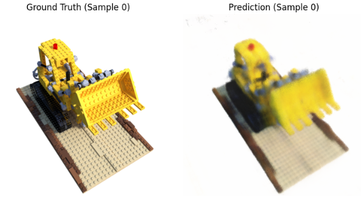 | 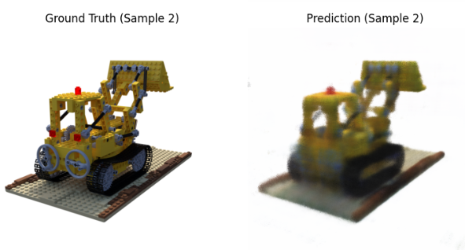 | **Coarse Geometry Initialization**<br>• Initial spatial density density field learning<br>• Low PSNR; visible volumetric artifacts |
| **150** | 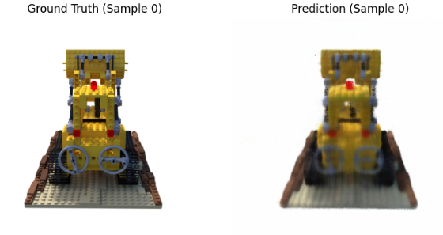 | 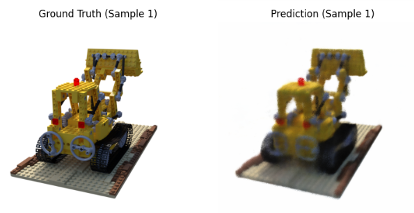 | **Structural Convergence**<br>• Primary surface bounds & silhouette refinement<br>• Fine-network importance sampling activation |
| **250** | 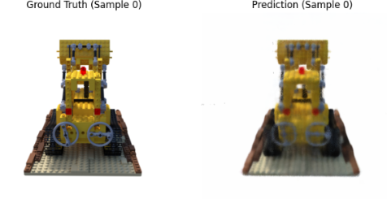 | 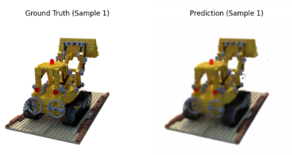 | **Color & Texture Synthesis**<br>• Albedo & diffuse color resolution<br>• Reduction in cloudiness/translucency |
| **350** | 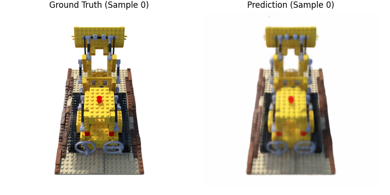 | 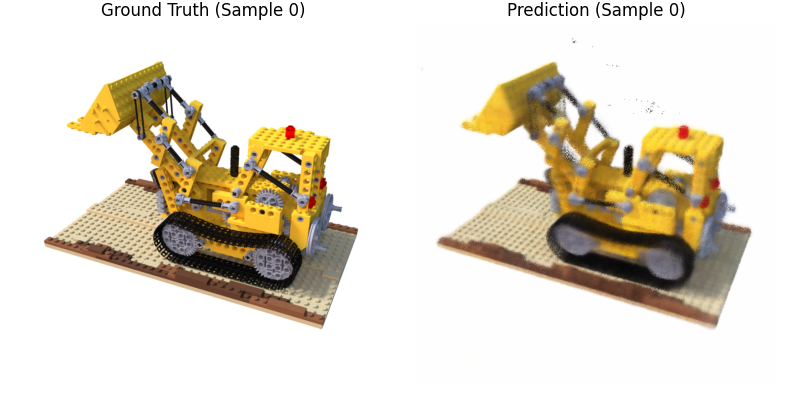 | **High-Frequency Detail Recovery**<br>• Fine spatial frequency recovery ($\gamma(\mathbf{x})$ mapping)<br>• Sharp boundary edges |
| **500** | 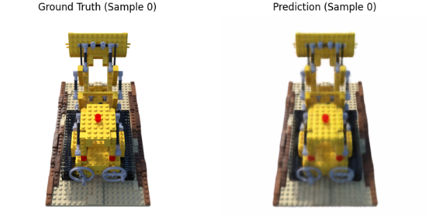 | 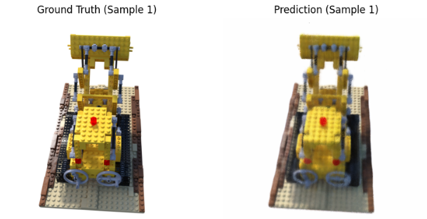 | **Fully Converged Radiance Field**<br>• High-fidelity specular highlights & novel view synthesis<br>• Peak PSNR & SSIM metrics |

---

## Training Curves

| Total Training Loss | Coarse Network Loss | Fine Network Loss |
|:-------------------:|:-------------------:|:-----------------:|
| 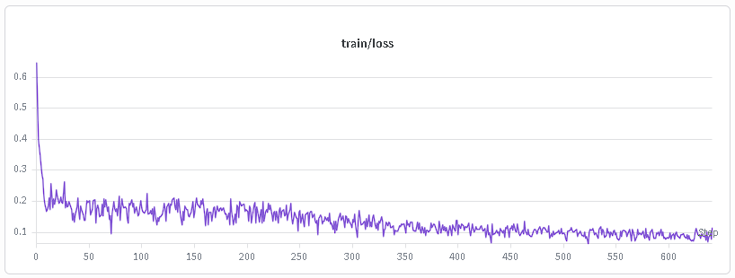 | 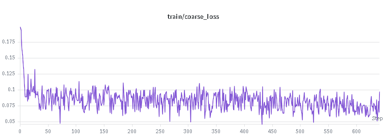 | 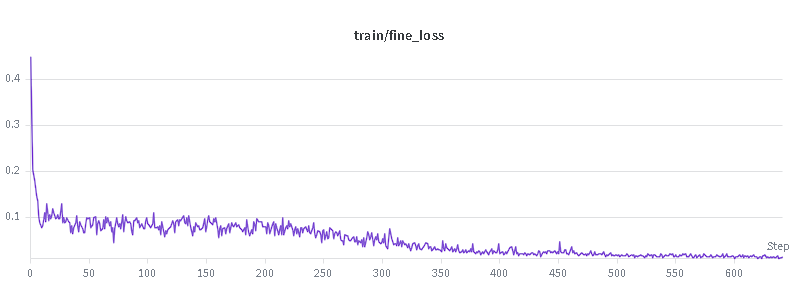 |

---

### Compact Quick-Reference Summary

If a concise 3-stage summary table is preferred for the top section of the paper repository:

| Stage 1: Initial (Epoch 50) | Stage 2: Intermediate (Epoch 250) | Stage 3: Fully Converged (Epoch 500) |
| :---: | :---: | :---: |
|  |  |  |
| *Coarse spatial density learning* | *Texture & color refinement* | *High-fidelity view synthesis* |

---


## Project Structure

The project is structured into modular PyTorch components inside `src/`:

```text
NeRF/
├── checkpoints/              # Saved model weights (.pt / .pth)
├── data/                     # Dataset directory (Blender / Synthetic NeRF)
├── renders/                  # Output renders (images / videos)
├── src/
│   ├── coarse_network.py     # Coarse MLP architecture
│   ├── fine_network.py       # Fine MLP architecture
│   ├── config.py             # Global hyperparameter management
│   ├── dataset_loader.py     # Data pipeline for Synthetic NeRF (Blender format)
│   ├── importance_sampler.py # Inverse CDF / Hierarchical sampling strategy
│   ├── main.py               # Main training loop entry point
│   ├── mlp.py                # Core NeRF network structure
│   ├── nerf_trainer.py       # Trainer class handling optimization & logging
│   ├── positional_encodings.py # High-frequency positional encoding (γ)
│   ├── random_ray_sampler.py # Random pixel/ray sampling logic
│   ├── ray_generator.py      # Pinhole camera model & ray generation
│   ├── render_img.py         # Full-image rendering pipeline
│   ├── stratified_sampler.py # Uniform bin sampling along rays
│   └── volume_renderer.py    # Alpha compositing & quadrature rendering
├── nerf_imp.ipynb            # Interactive exploration & debugging notebook
├── requirements.txt          # Python environment dependencies
└── README.md

```

---

## Core Methodology Overview

This implementation faithfully reproduces the two-stage NeRF pipeline:

1. **Ray Generation:** Rays $\mathbf{r}(t) = \mathbf{o} + t\mathbf{d}$ are generated for each pixel using pinhole camera intrinsics.
2. **Positional Encoding:** Spatial coordinates $\mathbf{x} = (x, y, z)$ and viewing directions $\mathbf{d} = (\theta, \phi)$ are mapped to a higher-dimensional space using Fourier features:

$$\gamma(p) = \left( \sin(2^0 \pi p), \cos(2^0 \pi p), \dots, \sin(2^{L-1} \pi p), \cos(2^{L-1} \pi p) \right)$$


3. **Hierarchical Sampling:**
* **Stratified Sampling:** Samples $N_c$ coarse points along each ray.
* **Importance Sampling:** Evaluates the coarse network weight distribution to sample $N_f$ additional fine points in high-density regions.


4. **Volume Rendering:** Density $\sigma$ and RGB color $\mathbf{c}$ are accumulated along rays via numerical quadrature:

$$\hat{C}(\mathbf{r}) = \sum_{i=1}^{N} T_i \left( 1 - \exp(-\sigma_i \delta_i) \right) \mathbf{c}_i, \quad \text{where } T_i = \exp\left(-\sum_{j=1}^{i-1} \sigma_j \delta_j\right)$$


---

## Quick Start

### 1. Prerequisites & Installation

Clone the repository and install dependencies:

```bash
git clone https://github.com/AbhinandanMandal/StyleRFPro/tree/main/NeRF
cd Team-SHA/NeRF
pip install -r requirements.txt

```

### 2. Dataset Setup

This repository supports the standard **Synthetic NeRF / Blender dataset** (e.g., Lego, Chair, Drums). Download a dataset from the [official NeRF repository](https://www.google.com/search?q=https://drive.google.com/drive/folders/128yAPlBh7O4yCc3jn13dTH2eHM-3uv75) and organize it as follows:

```text
data/
└── lego/
    ├── transforms_train.json
    ├── transforms_val.json
    ├── transforms_test.json
    ├── train/
    ├── val/
    └── test/

```

---

## Execution Instructions

### Training

To launch training using default parameters or custom hyperparameter configurations:

```bash
python src/main.py

```

*Weights and training logs will automatically save to `checkpoints/` and `wandb/` (if enabled).*

### Evaluation & Rendering

Render images from a trained checkpoint using the inference script.

**Basic Usage**

```bash
python src/render_img.py
```

**Arguments**

| Argument | Description | Default |
|----------|-------------|---------|
| `--checkpoint` | Path to the trained checkpoint | `./checkpoints/epoch_500.pth` |
| `--root_dir` | Path to the NeRF dataset | `data/nerf_synthetic/lego` |
| `--split` | Dataset split (`test` or `val`) | `test` |
| `--n_images` | Number of images to render | `1` |
| `--scale` | Rendering scale factor | `1.0` |
| `--num_rays` | Number of rays processed per rendering chunk | `1024` |
| `--n_points` | Number of coarse samples per ray | `64` |
| `--n_importance` | Number of fine samples per ray | `64` |

**Examples**

Render a single test image:

```bash
python src/render_img.py --checkpoint checkpoints/epoch_500.pth
```

Render 4 validation images:

```bash
python src/render_img.py --checkpoint checkpoints/epoch_500.pth --split val --n_images 4
```

Render at half resolution:

```bash
python src/render_img.py --checkpoint checkpoints/epoch_500.pth --scale 0.5
```

Render using a larger rendering chunk:

```bash
python src/render_img.py --checkpoint checkpoints/epoch_500.pth --num_rays 4096
```

Render with 128 coarse and fine samples:

```bash
python src/render_img.py --checkpoint checkpoints/epoch_500.pth --n_points 128 --n_importance 128
```

---

## Citation

If you find this implementation helpful for your research or reference, please consider citing the original landmark paper:

```bibtex
@inproceedings{mildenhall2020nerf,
  title={NeRF: Representing Scenes as Neural Radiance Fields for View Synthesis},
  author={Ben Mildenhall and Pratul P. Srinivasan and Matthew Tancik and Jonathan T. Barron and Ravi Ramamoorthi and Ren Ng},
  booktitle={ECCV},
  year={2020}
}

```

---

## License

This project is licensed under the MIT License - see the [LICENSE](https://www.google.com/search?q=LICENSE) file for details.